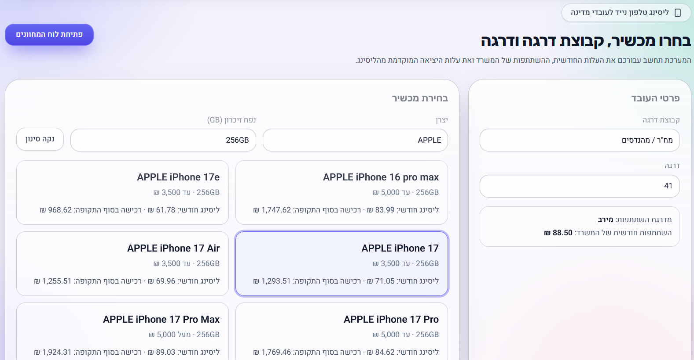

# לוח ליסינג טלפון ממשלתי

מחשבון עלויות אינטראקטיבי לעובדי מדינה בתוכנית הליסינג לטלפון סלולרי — בוחרים דרגה ומכשיר, ומקבלים את העלות החודשית והכוללת בפועל.

🔗 **[לאתר החי](https://gov-phone-dashboard.vercel.app/)**



> ⚠️ **כלי עזר לא רשמי** — מבוסס על מידע פומבי בלבד, ועלול להכיל טעויות או אי-דיוקים. בכל מקרה של סתירה בין המוצג באתר לבין הוראות התכ"ם התקפות — הוראות התכ"ם הן המחייבות.

## מה האתר עושה

המשתמש בוחר קבוצת דרגה, דרגה, ומכשיר. הדשבורד מחשב:

- עלות חודשית מהכיס של העובד, והשתתפות המשרד מדי חודש
- אחוז ניצול מכסת ההשתתפות — כמה מהמכסה נוצל, וכמה נשאר על השולחן אם המכשיר זול ממנה
- עלות רכישת המכשיר בסוף תקופת הליסינג
- עלות סיום ההתקשרות בכל חודש נתון — עם אפשרות לבחור אם המחיר כולל רכישת המכשיר (שומרים אותו) או לא (מחזירים אותו)
- השוואה בין המכשיר הנבחר לחלופה הזולה והיקרה ביותר, לפי אותו תרחיש סיום התקשרות

המטרה היא שקיפות — רוב העובדים לא רואים את הפירוק המדויק של המספרים האלה לפני שהם נרשמים למכשיר.

## איך מריצים את זה מקומית

```bash
git clone https://github.com/YoniGR94/gov_phone_dashboard.git
cd gov_phone_dashboard
npm install
npm run dev
```

## שלבי השימוש

### שלב 1 — בחירת דרגה ומכשיר
בוחרים קבוצת דרגה (אקדמאים, מינהלי, צה"ל וכו'), דרגה, ומכשיר. האתר ממפה אוטומטית את הדרגה למכסת ההשתתפות המתאימה.

### שלב 2 — לוח המחוונים
מציג את התשלום החודשי של העובד, השתתפות המשרד, ניצול המכסה, מחיר רכישה בסוף התקופה, עלות מצטברת על פני זמן, סימולציית סיום התקשרות מוקדם (עם/בלי רכישת המכשיר), והשוואה בין מכשירים.

## טכנולוגיות

| שכבה | טכנולוגיה |
|---|---|
| Frontend | React, TypeScript, Vite |
| עיצוב | Tailwind CSS |
| גרפים | Recharts |
| אייקונים | Lucide React |
| פרסור CSV | PapaParse |
| Backend | Vercel Serverless Function (`/api/devices`) |
| אנליטיקס | Vercel Analytics |
| דיפלוי | Vercel |

## מקורות המידע

**מכשירים** — נשלפים בזמן אמת מגיליון Google Sheets, לא ישירות מהדפדפן. פונקציית שרת ב-Vercel (`api/devices.ts`) שולפת ומפרסרת את הגיליון בצד השרת: כך נמנעות שגיאות CORS מנקודת הייצוא של Google ל-CSV, מטופל מבנה הכותרת הדו-שורתי של הגיליון, כל שורה עם מחיר לא תקין נופלת (ולא מוצגת כ-0 ₪ בטעות), והתוצאה נשמרת במטמון בקצה הרשת (`s-maxage=3600, stale-while-revalidate=86400`) כדי לא לפנות ל-Google בכל בקשה.

**כללים עסקיים** — מכסות השתתפות, מיפוי דרגה-למכסה, ונוסחת סיום התקשרות מוקדם, מאוחסנים מקומית כ-JSON בתיקיית `public/data/`.

## מבנה הריפו

```
├── api/
│   └── devices.ts          # פונקציית שרת: שליפה ופרסור של גיליון המכשירים
├── public/data/
│   ├── gradeBands.json      # מכסות השתתפות לפי דרגה
│   ├── gradeLookup.json     # מיפוי דרגה -> מכסה
│   └── terminationRules.json
├── src/
│   ├── components/          # DeviceSelector, GradeSelector, Charts, SummaryCards
│   ├── pages/                # SelectionPage, DashboardPage
│   ├── services/              # data.ts (שליפת נתונים), calculations.ts (נוסחאות העלות)
│   └── types.ts
└── deep-research-report.md   # מסמך התכנון/ארכיטקטורה המקורי
```

## מגבלות

- רשימת המכשירים תלויה במבנה החי של גיליון ה-Google Sheets המקורי — שינוי במבנה העמודות מחייב עדכון תואם ב-`api/devices.ts`.
- אין עדיין חבילת בדיקות אוטומטיות; הנכונות מאומתת ידנית מול גיליון המקור.
- הכללים העסקיים (מכסות, דרגות) הם JSON סטטי, לא ניתנים לעריכה מממשק ניהול — עדכון מחייב שינוי קוד ודיפלוי מחדש.
- המחשבון מבוסס על מידע פומבי בלבד ואינו כלי רשמי — המידע הקובע הוא [הוראות תכ"מ 16.7.1](https://takam.mof.gov.il/document/HM.16.7.1).

## קרדיט

יוני גטהון · [LinkedIn](https://www.linkedin.com/in/yoni-getahun/) · [GitHub](https://github.com/YoniGR94/gov_phone_dashboard)
