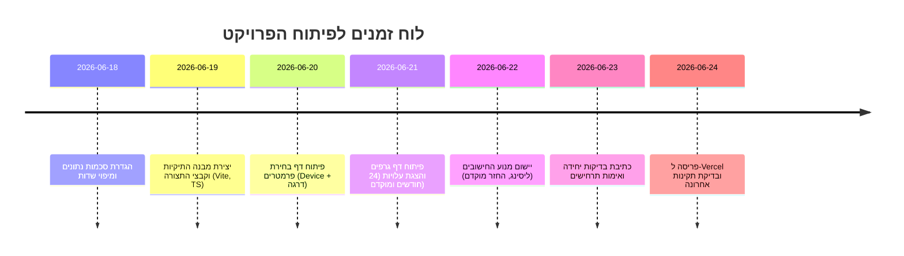

# תקציר מנהלים  
אפליקציית הדשבורד נועדה לחשב לעובדי המדינה את עלויות הליסינג של מכשירי סלולר על פי סוג וגובה הדרגה שלהם. הפרויקט יהיה מבוסס **React+TypeScript עם Vite**, יטען נתונים סטטיים מכתובות URL פתוחות (JSON/CSV) ויציגם ברכיבים ויזואליים. מבנה הקבצים יופרד לפי נושאים (דפים, רכיבים, Utils וכדומה) כדי לתמוך בהרחבה ובתחזוקה עתידית. לדוגמה, נשתמש בספריות כגון **Tailwind CSS** (סטיילינג יעיל עם פלאגין ל-Vite), **React Router** לניווט בין המסכים, **Recharts** להצגת גרפים, **Lucide-react** לאייקונים SVG, **Zod** לוולידציית סכמות נתונים, **React Hook Form** לטפסים, ו-**Papa Parse** לייבוא CSV. כל הלוגיקה (מיפוי דרגות, חישובי ליסינג והחזר מוקדם) תרוץ בלקוח דרך hooks ו-utils. לבסוף נפרוס את האתר כ-Static Site ב-Vercel/GitHub Pages ללא שרת מיוחד.  



## 1. מבנה התיקיות והקבצים  
```
project-root/
  public/
    index.html           - תבנית HTML בסיסית (מכילה <div id="root">)
    favicon.ico          - סמל האתר
  data/
    devices.json         - רשימת המכשירים (טבלה מה-Excel/Google Sheets)
    gradeBands.json      - הגדרות מדרגי עובדים (נספח לפי סוגי שירות)
    groupMapping.json    - מפה: משרד/סוג גוף → מדרג מתאים
    services.json        - שירותים נלווים ומחיריהם החודשיים
    terminationRules.json- תרחישי החזר מוקדם ונוסחאות קשורות
  src/
    pages/
      SelectionPage.tsx  - דף ראשון: בחירת טלפון, סוג ודרגת שירות
      DashboardPage.tsx  - דף שני: הצגת גרפים ותוצאות (KPI, עלויות)
    components/
      DeviceSelector.tsx - קומפוננט לבחירת דגם מכשיר
      GradeSelector.tsx  - קומפוננט לבחירת סוג ודרגה
      ChartContainer.tsx - מארגן את רכיבי הגרפים העיקריים
      KPIcards.tsx       - כרטיסי סיכום עלויות (עובד/משרד/סוף ליסינג)
      BackButton.tsx     - כפתור “חזור” למסך הבחירה
    hooks/
      useData.ts         - hook לטעינת JSON מ-URL ולולידציה באמצעות Zod
      useGrade.ts        - hook לחישוב מכסת השתתפות לפי משרד/דרגה
    utils/
      calculations.ts    - פונקציות חישוביות: עלות חודשית, עלות ממוצבת, החזר מוקדם
      constants.ts       - קבועים כלליים (למשל תקופת ליסינג, אחוזי הנחה)
    styles/
      tailwind.css       - קובץ הראשי ל-Tailwind (כולל @tailwind directives)
    tests/
      calculations.test.ts   - בדיקות נוסחאות חישוב
      components.test.tsx    - בדיקות קומפוננטות React (לדוג’, SelectionPage)
    App.tsx             - רכיב שורש שמגדיר את הניווט בין הדפים
    main.tsx            - נקודת כניסה של React (רינדור <App />)
    vite.config.ts      - קובץ קונפיגורציית Vite (כולל Plugin של Tailwind)
    tsconfig.json       - הגדרות TypeScript (strict mode וכו’)
    .eslintrc.cjs       - כללי ESLint להתאמת סטייל וקוד נקי
    jest.config.js      - קונפיגורציית Vitest/Jest לסביבת בדיקות
```

## 2. סכמות הקבצים (JSON/CSV)  
ניתן לארגן את הנתונים כקבצי JSON או כקבצי CSV ציבוריים. להלן שדות עיקריים לכל קובץ, כולל השמות בעברית (`[מפתח באנגלית]`) וסוג הנתונים:

- **devices.json (מכשירים)**:  
  - `id` – מזהה המכשיר (מספר)  
  - `manufacturer` – יצרן (מחרוזת)  
  - `model` – דגם (מחרוזת)  
  - `memory_gb` – נפח זיכרון ב־GB (מספר)  
  - `lease_monthly` – עלות ליסינג חודשית (₪, כולל מע"מ, מספר)  
  - `purchase_cost` – עלות רכישה בסוף התקופה (₪, כולל מע"מ, מספר)  
  - `weighted_price` – מחיר מחירון משוקלל (₪, כולל מע"מ, מספר)  
  - `price_band` – שיוך ל“מדרגת מחיר” (מחרוזת, לדוג’ “זול”, “בינוני”)  
  - `update_date` – תאריך עדכון/הפסקת מכירה (תאריך כמחרוזת ISO)  
  - `notes` – הערות כלליות (מחרוזת)  

- **gradeBands.json (מדרגים – נספח השתתפות משרד)**:  
  - `group` – שם קבוצת עובדים (מחרוזת, לדוג’ "בכיר א׳", "ONLY SIM", "משפטנים")  
  - `min_grade` – דרגה מינימלית (מספר)  
  - `max_grade` – דרגה מקסימלית (מספר)  
  - `monthly_allowance` – מכסת השתתפות חודשית (₪ ללא מע"מ, מספר)  
  - `includes_vat` – האם העזרה כוללת מע"מ (בוליאני)  
  - `notes` – הערות נוספות (מחרוזת)  

- **groupMapping.json (שיוך גופים למדרגים)**:  
  - `body` – שם גוף/משרד (מחרוזת, לדוג’ “משרד התחבורה”, “צה"ל”)  
  - `grade_group` – קוד המדרג התואם (מחרוזת, מתאים לשדה `group` ב-gradeBands)  
  - `note` – הערות במידה ויש (מחרוזת)  

- **services.json (שירותים נלווים)**:  
  - `code` – קוד השירות (מחרוזת, לדוג’ "ONLY_SIM", "protected", "extension", "headphones")  
  - `name` – שם השירות (מחרוזת)  
  - `monthly_cost` – עלות חודשית ללקוח (₪, מספר)  
  - `included_in_allowance` – האם השירות נכלל במכסת ההשתתפות (בוליאני)  
  - `requires_commitment` – האם השירות דורש התחייבות (בוליאני)  
  - `notes` – הערות (מחרוזת)  

- **terminationRules.json (החזר מוקדם)**:  
  - `scenario` – קוד תרחיש (מחרוזת, למשל "before_24", "death", "after_24")  
  - `condition` – תנאי (מחרוזת, למשל "month < 24", "event == death")  
  - `employee_cost_formula` – נוסחה לחישוב עלות לעובד (מחרוזת, יתוארות בפסאודו־קוד)  
  - `description` – תיאור התרחיש בעברית (מחרוזת)  
  - `notes` – הערות (מחרוזת)  

## 3. חבילות ותלויות (React / TypeScript / DevTools)  
- **react, react-dom** – ספרית ה-UI הבסיסית של React לצורך רינדור רכיבים.  
- **react-router-dom** – ספרייה לניווט דפים ב-SPA (ניהול כתובות URL).  
- **typescript** – תמיכה ב-TypeScript; מוודא טיפוסים סטטיים.  
- **vite** – כלי Build מודרני ל-React+TS (מהיר, מבוסס ES modules).  
- **tailwindcss** – ספריית CSS “utility-first” לסטיילינג מהיר.  
- **@tailwindcss/vite** – פלאגין רשמי ל-Vite להתקנת Tailwind.  
- **shadcn/ui** – סט קומפוננטות React (מבוסס Tailwind), מאפשר להתחיל במהירות רכיבי UI מוכנים.  
- **lucide-react** – ספריית אייקונים (SVG) לריאקט; כל איקון כקומפוננט בפני עצמו.  
- **recharts** – ספריית גרפים מבוססת React (קוים, עמודות וכד’).  
- **zod** – ספריית ולידציית סכמות TypeScript (הגדרה מקוננת של מבני נתונים).  
- **react-hook-form** – ספרייה לניהול טפסים ווידוא תקינותם ב-React.  
- **papaparse** – פענוח CSV בדפדפן (מקרים גדולים).  
- **vitest** – מסגרת בדיקות מקומפוו-לבית ל-Vite (מהיר, Jest-compatible).  
- **@testing-library/react** – ספריית בדיקות קומפוננטות React (טסטים מבוססי DOM).  
- **eslint, prettier** – כלי lint ו-format לשמירה על קוד נקי ועקבי.  

> **מקורות:** Tailwind עם Vite; Recharts גרפים ב-React; ספריית אייקונים Lucide; Zod לוולידציה; PapaParse לקריאת CSV; React Router לניווט; Vitest לבדיקות ב-Vite.  

## 4. תיאור הצורך, מודל הנתונים וזרימת משתמש  
מטרת הדשבורד היא לאפשר לעובדי מדינה לדעת **בקלות** מה יעלה להם לבחור במכשיר חדש או לחסוך בעלויות על בסיס הסכם הליסינג של המדינה. המשתמש ייכנס לדף בחירה, יבחר יצרן/דגם, סוג הדרגה ודרגה מדויקת, ולחיצה תעביר אותו לדף התוצאות. שם יוצגו מספר **KPI** מרכזיים: עלות חודשית לעובד, עלות חודשית למשרד, עלות רכישה בסוף 24 חודשים, ועלות יציאה מוקדמת אם יפסיק את ההתקשרות בכל חודש (המחושבת לפי הנוסחאות בנספח). המודלים (מסמכי JSON) יכללו את טבלת המכשירים, טבלאות מיפוי הדרגות ומכסת ההשתתפות, והגדרות שירותים נלווים ותעריפיהם. דף התוצאות יציג גרפים המשתקפים בטבלה זו – למשל גרף קו של עלות המצטברת של העובד בחודשים, וגרף עמודות של עלות מוקדמת לפי חודש.  

בסופו של דבר הפלט יהיה **אפליקציית ווב סטטית**, שבה כל הנתונים מוטענים מ-URL ציבורי (Google Sheet/גיטהאב). יש לקבוע **נקודות חיבור (URLs)** בקוד (לדוגמה, משתנה `DEVICES_URL = '<URL1>'`), ובשלב הפריסה יש להחליפם בכתובות האמיתיות. אפשר לפרוס ל-Vercel ללא עלות, כש-GitHub Pages הוא גם אופציה לנגישות ציבורית של הקבצים.  

## 5. מקורות נתונים וכתובות URL (איפה לשים “URL1”)  
יש לשמור את כתובות ה-API או קבצי ה-JSON במשתני קונסטנטים נגישים בקוד (למשל בקובץ `useData.ts`). לדוגמה:  
```ts
const DEVICES_URL = 'https://docs.google.com/spreadsheets/d/13HhcspJ_P0jnCmdz7icVeKQJCGWdur5vJ0wWfM5Wu_I/htmlview'; // קישור לגיליון המכשירים
const GRADE_BANDS_URL = '<URL2>'; 
// וכך הלאה עבור מקורות אחרים
```  
בשלב פיתוח ניתן להגדיר ערכי תקן (example.com), ולאחר מכן להחליפם בכתובות המלאות של Google Sheets ציבורי או קבצים ב-GitHub.  

## 6. לוגיקת ריצה (פסאודו־קוד)  
1. **טעינת נתונים:** בעת התחלת האפליקציה, הפונקציה `useData.ts` תבצע `fetch(DEVICES_URL)` + `Papa.parse` אם צריך (אם זה CSV) או `fetch` ל־JSON. התוצאה תועבר ל-Zod לסכמת ולידציה (מבוססת `devices.json`), ואז תשמר ב-State או בהקשר (Context/Redux).  
2. **מיפוי דרגות:** בהתאם ל־`groupMapping.json`, נקבע את ה־`grade_group` הרלוונטי לגוף נבחר. לאחר מכן משתמשים ב־`gradeBands.json` לחישוב מכסת ההשתתפות: מציאת האובייקט המתאים לטווח הדרגה שווה/קרובה ביותר, ולהוציא ממנו את מכסת השיתוף.  
3. **חישובי ליסינג חודשי (1–24):** לכל חודש 1..24:  
   - חשב מה העלות החודשית המלאה (משלמים מיסים) למכשיר הנבחר.  
   - חשב כמה העובד משלם (עלות – השתתפות המשרד), וכמה המשרד משלם.  
   - צבור עלויות מצטברות (חודשות) בכל נקודה.  
   - ערוך טבלת תוצאות זמנית של חודש מול עלות מצטברת.  
4. **עלות יציאה מוקדמת:** עבור כל חודש `m` אפשר לחשב:  
   - **אם העובד רוצה לשמור את המכשיר:** חישוב לפי נוסחת נספח ו': `employeeCost = weightedPrice - (m * monthlyLeaseCost)` (לדוגמה).  
   - **אם העובד מחזיר את המכשיר (ליסינג מוקדם):** עלות כמותית לפי ניסוח דומה.  
   - **במקרה של פטירה:** סך יתרת תשלומים + גרט (לפי נספח ההוראות).  
   הנוסחאות המדויקות יודגמו ב־`calculations.ts`.  
5. **אחרי 24 חודשים:** אם לא החליף המכשיר, ההצגה תשתמש בחוקים מנספח ו' (הנחות על גרט לאחר 24 חודשים).  
6. **ניווט בין דפים:** שימוש ב־React Router – כאשר בוחרים פרמטרים נשמרים ב־state/URL (לדוג’, `?device=Samsung&grade=37`), ולאחר מעבר למצב Dashboard סך כל התחשיבים מוצג. כפתור “חזור” פשוט חוזר לדף הקודם (פונקציה היסטוריית הדפדפן או Link).  

## 7. בדיקות ומקרי מבחן  
**מטרות הבדיקה:** לאמת שכל חישוב מניב תוצאה נכונה ולוודא שזרימת המשתמש תקינה.  

- **בדיקות נתונים (Data Tests):**  
  - ווידוא שכל שדה ב־JSON נטען ל־type הנכון (למשל `lease_monthly` מספרי).  
  - בדיקה ש־grade_bands ו־group_mapping מתחברים נכון (לדוג’: משרד נתון מפנה למדרג הצפוי).  

- **בדיקות לוגיקה (Business Logic):**  
  - **החזר מוקדם:** דוגמה: נניח `weightedPrice=400`, `monthlyLeaseCost=20`. אחרי 5 חודשים: `expectedCost = 400 - (5*20) = 300`. וידוא שהפונקציה מחזירה זאת.  
  - **אחרי 24 חודשים:** נניח `purchaseCost=200`, הנחה 15%: עלות = `170`. בדיקה שהחישוב לוקח הנחות נכונות (נספח ו' מפרט החזר 15% ב-27–30 חודשים).  
  - **עלות חודשית מצטברת:** בחר מכשיר ידוע (למשל עלות ליסינג 10₪, מכסת משרד 3₪). אחרי 3 חודשים העובד שילם `7+7+7=21`.  
  - **אפילטיב (Off-By-One):** ודאו שחישובי חודש מושלמים (1..24, כולל חודש 24).  

- **בדיקות UI / נגישות:**  
  - מעבר בין המסכים עובד (BackButton חוזר כראוי).  
  - בחירה ושמירת פרמטרי טלפון–דרגה נשמרים בכתובת (לבדיקה משחזרי דף).  

- **כלים:** ניתן להשתמש ב־Vitest עם React Testing Library. למשל לבדוק ש־`calculations.ts` מחזירה ערכים צפויים במבחני יחידה; ש־`SelectionPage` טוען את רשימת המכשירים מתוך ה־JSON. ווודאו שכאשר `useData` נתקל בשגיאה (נתון חסר), הטעות מטופלת ב־state.  

**בדיקות לדוגמה:**  
1. מכשיר “X” בעל `lease_monthly=50`, `weighted_price=1000`. **חישוב מצטבר:** לאחר 10 חודשים צובר עובד 10×50=500₪ (לפני השתתפות). בדוק שהגרף מציג זאת נכון.  
2. **עזיבה מוקדמת חודש 6:** עובד עם המכשיר שלעיל – עלות מעודכנת צריכה להיות `1000 - (6×50) = 700`.  
3. **פטירת העובד (12 מתוך 24):** נניח שנותרו 12 תשלומים של 50₪ (600₪) + גרט 1000₪ = 1600₪. בדוק שהחישוב מחזיר סכום זה.  

> **לסיכום:** הפרויקט פשוט יחסית מבחינת מבנה – הוא מצריך אפליקציית SPA סטטית עם שני דפים והצגת נתונים. המורכבות האמיתית היא בניפוח הנתונים הטכניים ל־JSON תקני ובבדיקת הנוסחאות לפי סעיפי ההסכם, יותר מאשר הקוד עצמו. עם מסמך סכמות מוגדר ותשתית React מתאימה, פיתוח המודולים והשילוב עם Vercel חינם ייעשו ללא מכשול משמעותי. החבילות שהוזכרו תומכות בדיוק במידת הצורך (למשל Tailwind לקלילות CSS, Zod ללידציה, Vitest לבדיקה). עבודה בסביבה זו תשאיר את הפרויקט פתוח וניתן לתחזוקה עתידית בקלות.